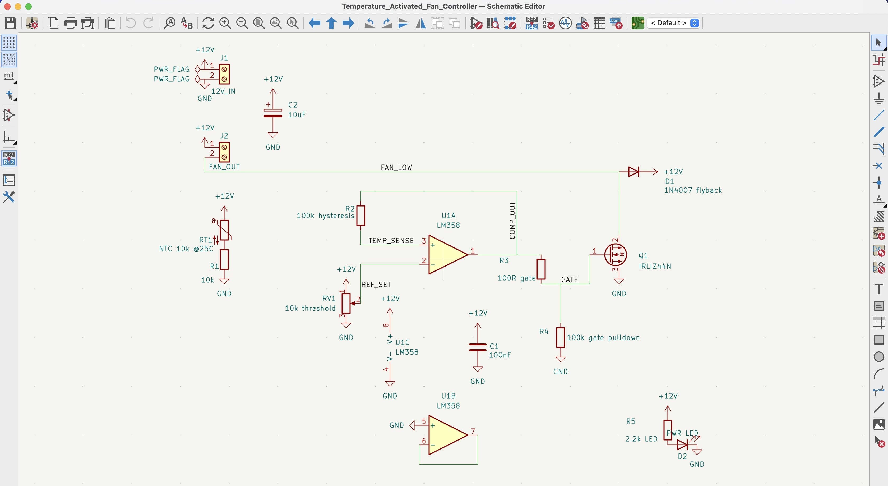
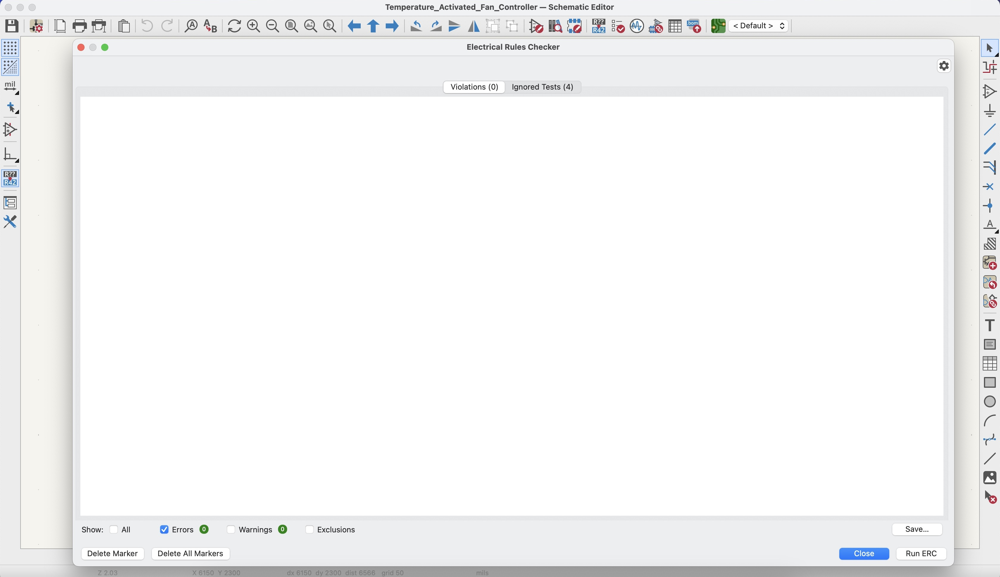
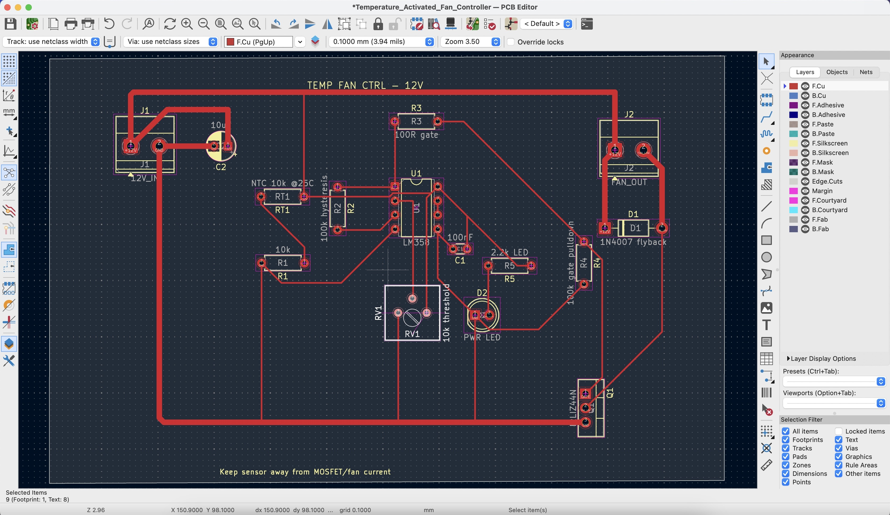
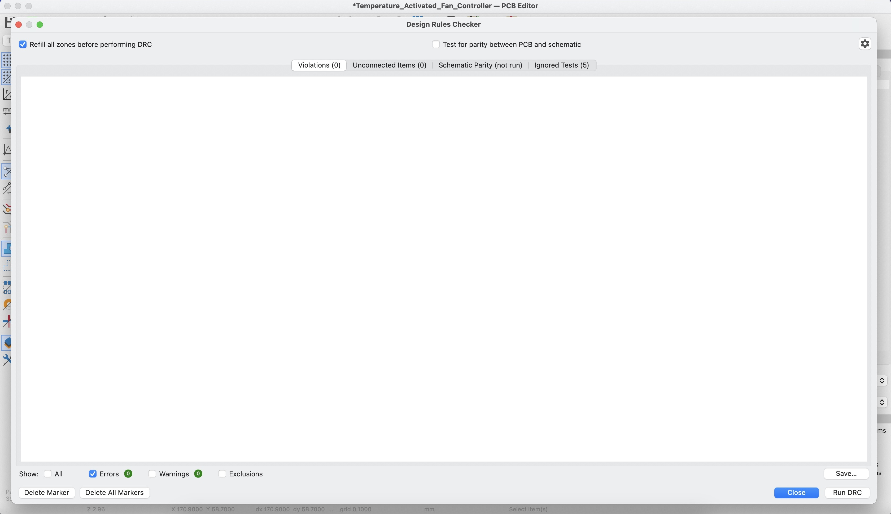
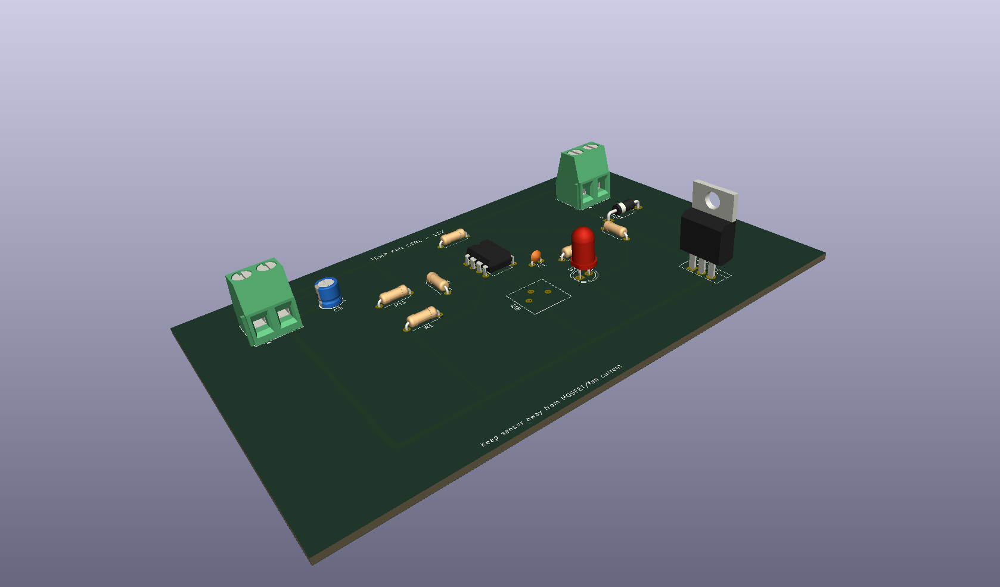

# Temperature-Activated Fan Controller

A 12V fan controller circuit designed in KiCad. The board turns a cooling fan on or off based on temperature using a 10k NTC thermistor, an LM358 comparator, and an IRLIZ44N MOSFET.

This project is part of my electronics design portfolio. The focus was on building a practical thermal management circuit with a clean schematic, routed PCB layout, and proper ERC/DRC verification.

## Project Summary

The circuit senses temperature through an NTC thermistor voltage divider. A 10k potentiometer sets the fan turn-on threshold. The LM358 compares the thermistor voltage against the threshold voltage, then drives the MOSFET gate when the fan should turn on.

The fan is switched using a low-side MOSFET arrangement. The fan positive terminal is tied to +12V, while the MOSFET controls the ground side of the fan. A 1N4007 diode is placed across the fan output to protect the MOSFET from voltage spikes when the fan turns off.

## Why I Built This

This project is more practical than a simple light sensor circuit because thermal control is common in real electronics systems. Power supplies, motor drivers, amplifiers, embedded boards, and battery systems often need basic fan control or thermal protection.

The project demonstrates:

* Analog sensor interfacing
* Comparator-based switching
* Adjustable threshold control
* Hysteresis feedback
* MOSFET load switching
* Inductive load protection
* PCB layout for power and signal separation

## Main Specifications

| Item               | Detail                        |
| ------------------ | ----------------------------- |
| Supply voltage     | 12V DC                        |
| Temperature sensor | 10k NTC thermistor @ 25°C     |
| Comparator         | LM358                         |
| Switching device   | IRLIZ44N N-channel MOSFET     |
| Fan control method | Low-side switching            |
| PCB type           | 2-layer PCB                   |
| Design software    | KiCad 10.0.1                  |
| Simulation         | Not included for this project |

## Circuit Operation

The NTC thermistor and a 10k resistor form a voltage divider. As temperature changes, the resistance of the thermistor changes, which also changes the voltage at the `TEMP_SENSE` node.

The 10k potentiometer creates an adjustable reference voltage called `REF_SET`. This lets the fan turn-on point be tuned manually.

The LM358 compares `TEMP_SENSE` against `REF_SET`. When the sensed temperature crosses the set threshold, the LM358 output changes state and drives the MOSFET gate through a 100Ω gate resistor.

The MOSFET switches the fan on the low side. This means the fan receives +12V directly, while the MOSFET connects or disconnects the fan’s ground path.

A 100k resistor provides hysteresis feedback from the comparator output back to the sensing node. This helps stop the fan from rapidly switching on and off when the temperature is close to the threshold.

## Key Design Choices

### NTC Thermistor Divider

The 10k NTC thermistor was paired with a 10k resistor to create a simple temperature-dependent voltage divider. Using equal nominal values around room temperature gives a useful mid-range voltage for the comparator input.

### Adjustable Threshold

A 10k potentiometer was used so the fan turn-on point can be adjusted without changing resistor values. This makes the circuit more flexible and easier to tune.

### Hysteresis Resistor

A 100k feedback resistor was added between the LM358 output and the temperature sensing node. This creates a small amount of hysteresis, which prevents fan chatter around the switching point.

### MOSFET Switching

The IRLIZ44N was selected because it is suitable for low-side switching of 12V fan loads and can be driven from a logic-level control signal. The MOSFET handles the fan current while the LM358 only drives the gate.

### Flyback Protection

The 1N4007 diode is placed across the fan output. Since a fan is an inductive load, it can produce a voltage spike when switched off. The diode gives that energy a safe path and protects the MOSFET.

### PCB Layout

The high-current fan path was routed with wider traces. The low-current sensor and comparator traces were routed separately using smaller traces. The thermistor was placed away from the MOSFET and fan output area to reduce unwanted heating and noise coupling.

## Main Components

| Reference | Component                  | Value / Part         |
| --------- | -------------------------- | -------------------- |
| U1        | Op-amp / comparator        | LM358                |
| Q1        | N-channel MOSFET           | IRLIZ44N             |
| RT1       | NTC thermistor             | 10k @ 25°C           |
| RV1       | Potentiometer              | 10k                  |
| R1        | Divider resistor           | 10k                  |
| R2        | Hysteresis resistor        | 100k                 |
| R3        | Gate resistor              | 100Ω                 |
| R4        | Gate pulldown resistor     | 100k                 |
| R5        | LED current-limit resistor | 2.2k                 |
| D1        | Flyback diode              | 1N4007               |
| D2        | Power indicator LED        | LED                  |
| C1        | Decoupling capacitor       | 100nF                |
| C2        | Bulk capacitor             | 10µF                 |
| J1        | Power input connector      | 2-pin screw terminal |
| J2        | Fan output connector       | 2-pin screw terminal |

## Verification

The design was checked in KiCad before finalizing the board.

| Check             | Result   |
| ----------------- | -------- |
| ERC               | 0 errors |
| DRC               | 0 errors |
| Unconnected items | 0        |

## Project Images

### Schematic



### ERC Result



### PCB Layout



### DRC Result



### 3D View



## Repository Structure

```text
Temperature_Activated_Fan_Controller/
├── README.md
├── hardware/
│   ├── Temperature_Activated_Fan_Controller.kicad_pro
│   ├── Temperature_Activated_Fan_Controller.kicad_sch
│   ├── Temperature_Activated_Fan_Controller.kicad_pcb
│   └── Temperature_Activated_Fan_Controller.kicad_prl
├── images/
│   ├── schematic.png
│   ├── erc_0_errors.png
│   ├── pcb_layout.png
│   ├── drc_0_errors.png
│   └── 3d_view.png
└── docs/
    └── bom.md
```

## Tools Used

* KiCad 10.0.1
* KiCad Schematic Editor
* KiCad PCB Editor
* KiCad 3D Viewer

## Status

Completed.

* Schematic finished
* PCB layout finished
* ERC passed with 0 errors
* DRC passed with 0 errors
* 3D board preview generated
